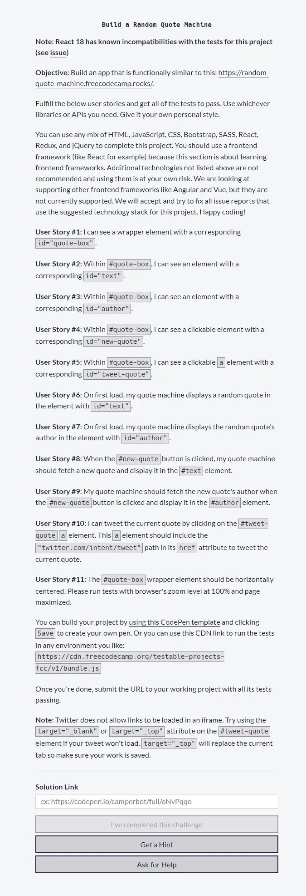
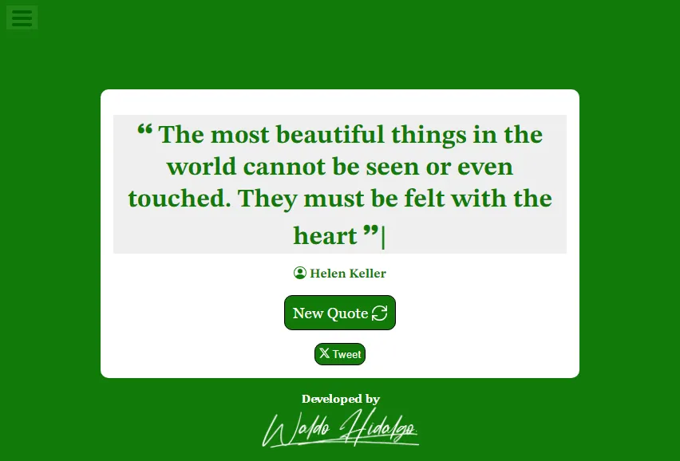
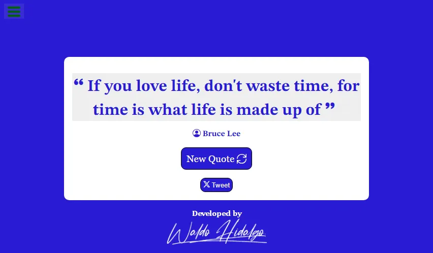
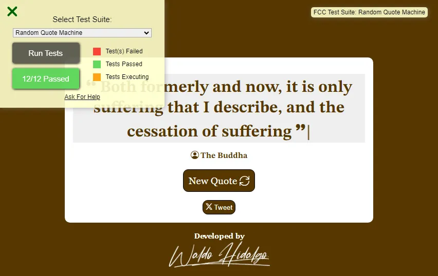

# Random Quote Machine: Primer Proyecto para obtener la certificación Front End Development Libraries de Freecodecamp

El presente repositorio contiene el código con el cual he contruido el primer proyecto de 5 proyectos en total requeridos para obtener la certificación [Front End Development Libraries](https://www.freecodecamp.org/learn/front-end-development-libraries) de Freecodecamp. El proyecto utiliza las siguientes dependencias:

 

Además de las librerias: **chroma-js**, **react-icons** y **typewriter-effect**.

La API de citas que he utilizado se encuentra en el siguiente [link](https://github.com/lukePeavey/quotable?tab=readme-ov-file)

## 1-Requisitos

El proyecto presenta los siguientes requisitos:

## 2-Screenshots

A continuación muestro un screenshot de una cita aleatoria:

Cuando se hace click en el botón **New Quote** se genera una nueva cita aleatoria:

## 3-Superación de **TODOS** los test

Cuando ejecuto los test de la **TEST SUITE** de **freecodecamp** seleccionando el proyecto **Random Quote Machine** se muestra un mensaje de aprobación de TODOS los 12 test requisitos para superar este primer proyecto:

